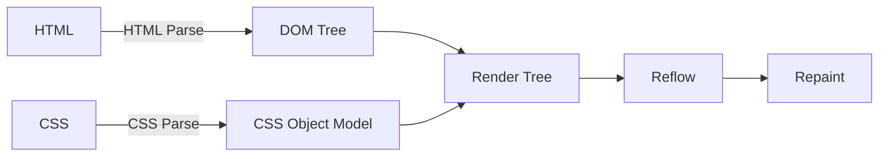

# Performance

HTML 속도 개선을 위해서는 기본적인 먼저 랜더링 순서를 파악하고 이를 개선해야 한다.

## HTML 랜더링 순서

1. 사용자가 브라우저에 URL을 입력하거나 이동을 한다.
2. 브라우저 인터페이스 엔진에서 해당 작업을 분석 한다.
3. 페이지 이동이 확인되면 해당 서버에 정보를 요청 한다.
    1. 도메인의 경우 `DNS Lookup` 을 통하여 서버 IP 경로를 얻어온다.
    2. 얻어온 서버 경로로 필요한 경로 정보를 요청 한다. (3 Way Handshake)
    3. HTTP 요청 응답이 MIME 타입을 확인하여 해당 자원을 다운로드 한다.
4. 다운로드 된 HTML 및 CSS 문서를 해석하는 과정을 거친다
    1. HTML 을 해석하여 DOM Tree 구성을 한다.
    2. CSS 를 해석하여 `CSSOM` (Cascading Style Sheets Object Model) 을 구성한다.
    3. 위 두 구성이 모두 완료 하여야만 다음 진행이 가능하다. (CSS : 랜더링 블라킹 요소)
    4. 이후 자바스크립트 태그 혹은 구문을 만나면 약속된 프로세스 (비차단 스크립트) 대로 진행 한다.
5. `DOM Tree` & `CSSOM` 이 완료 되면 `Render Tree` 구성을 진행한다.
    1. CSS 규칙중 `{display:none}` 을 만나면 `Render Tree` 구성에서는 빠진다. (`DOM Tree` 에는 존재)
6. `Render Tree` 구성이 완료되면 `Reflow` 작업을 통하여 필요한 레이아웃을 화면에 배치한다.
7. `Reflow` 작업이 완료 되면 `Repaint` 과정을 통하여 화면에 배치한 레이아웃을 그린다.

## HTML 개선 방안

HTML 랜더링 속도를 올리는 방법에는 다음과 같은 방법이 있다.

### HTTP Request 최소화

서버에 자원의 요청을 최소화 하는 방법으로 네트워크 레이턴시를 줄여 성능을 개선한다.

### Resource 압축

정적 리소스 (HTML, JS, CSS) 의 소스를 압축 (manifest) 하여 제공하는데  
JS, CSS 는 _**모듈 번들러**_ (webpack, manifest ... ) 를 통하여 제공하고  
HTML 은 _**gzip**_ 전송을 한다.

### Reflow, Repaint 최소화

추가적으로 브라우저에서 Reflow 를 일으킬만한 요소들을 최소화 하기 위하여 다음 가이드라인을 참고한다.

사용자의 브라우저 별로 리플루우 (Reflow) 가 걸리는 시간도 상이 하지만 대부분의 리플로우를 일으키는 조건은 동일하여 아래의 가이드라인을 통하여 충분히 개선이 가능하다.

* 불필요한 DOM Depth를 줄인다.
  * DOM Tree 의 Depth 하나를 변경하면 트리의 모든 Depth 에 따라 더 많은 시간이 소요된다.
  * 부모로는 Root, 자식은 Update 된 Node 까지 변경 될 가능성이 있음
* CSS 규칙을 최소화 하고 사용하지 않는 CSS 규칙을 삭제한다.
* 애니메이션과 같이 복잡한 랜더링 요소는 흐름의 밖에서 변경한다.
  * 변경시에는 절대 위치 혹은 고정 위치를 사용한다.
* 불필요하거나 복잡한 CSS 선택기 하위요소 선택기를 사용하지 않는다.
  * 선택기와 일치시키기 위해서 더 높은 GPU 처리량의 필요가 요구된다.

### 그 외 방법들

* 이미지 최적화
  * 큰 이미지를 CSS 로 잘라서 사용
  * BASE 64 Encoding 전송
* 브라우저 캐싱 사용
* 방문 리다이렉션 사용 안함

> Reference  
> 
> https://developers.google.com/speed/docs/insights/browser-reflow?hl=ko  
> http://lists.w3.org/Archives/Public/public-html-ig-ko/2011Sep/att-0030/Reflow_____________________________Tip.pdf  
> http://www.stubbornella.org/content/2009/03/27/reflows-repaints-css-performance-making-your-javascript-slow/