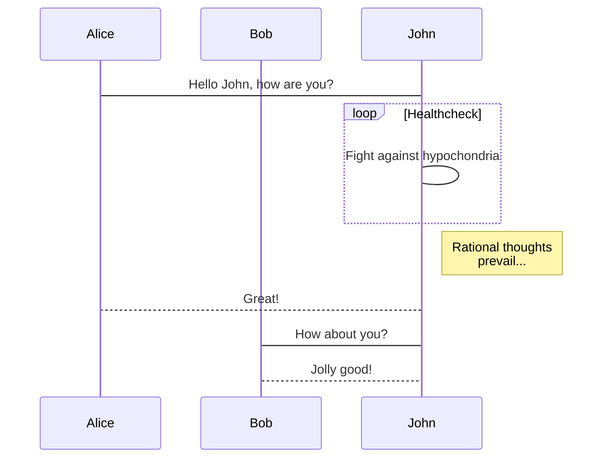
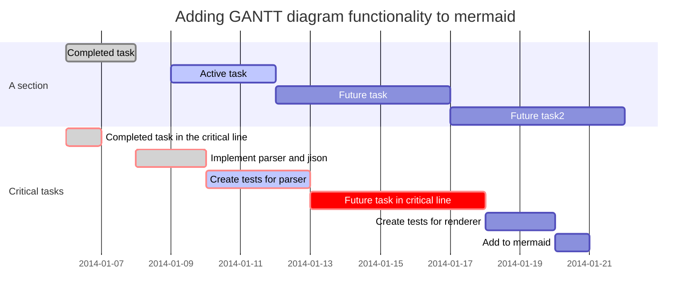
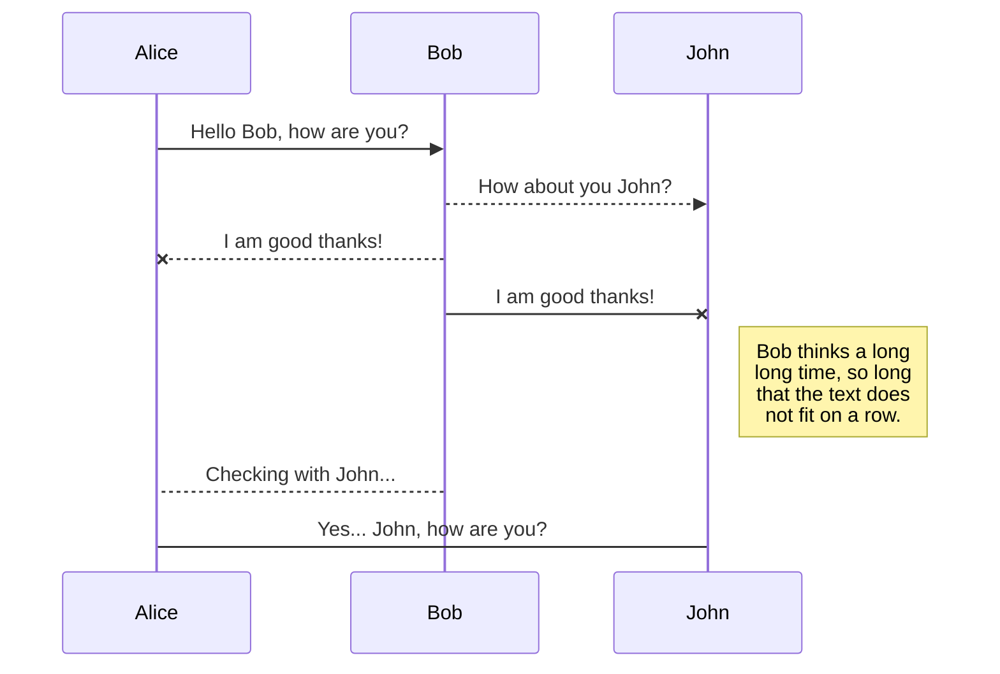
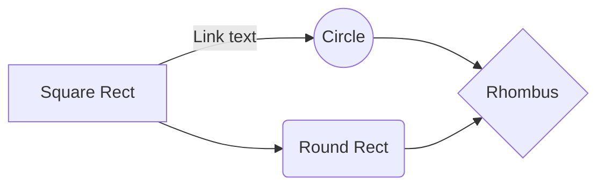
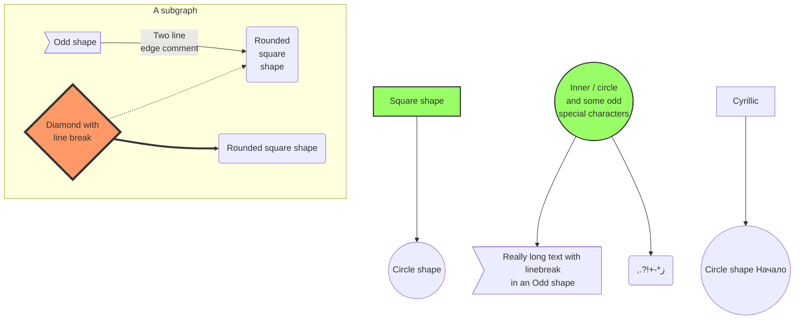
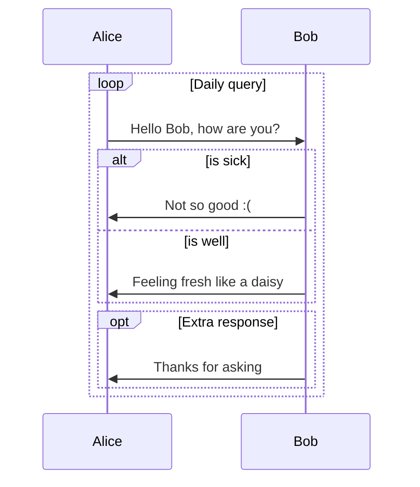

# Sudal's Note

# CLI
```bash
# Build
$ gitbook install

# Local Server
$ gitbook serve

# Remote Static Publish
./publish_gitbook.sh
```

# Tip

### 맥 백쿼트(`) 만들기

1. 스크립트 실행
```bash
$ if ! [ -f ~/Library/KeyBindings/DefaultkeyBinding.dict ]; then mkdir -p ~/Library/KeyBindings && echo '{"₩" = ("insertText:", "\`");}' > ~/Library/KeyBindings/DefaultkeyBinding.dict; fi
```

2. 어플리케이션 재 실행 (재부팅)

# Statement

# 제목 
## 분류
#### 중분류

내용내용내용

#### Syntax
```java
  public void main (String[] args) {

  }
```
#### Parameter
* args
  * 매개변수

#### Example #1 : Java
```java
  public void main (String[] args) {

  }
```
#### Example #2 : JS - ES5
```javascript
  function foo() {

  }
```
#### Example #2 : JS - ES6
```javascript
  var foo = () => {

  };
```

## callouts

> #### Info::Info
> description

##  

> #### Note::Note

##  

> #### Tag::Tag

##  

> #### Comment::Comment

##  

> #### Hint::Hint

##  

> #### Success::Success

##  

> #### Warning::Warning

##  

> #### Caution::Caution

##  

> #### Danger::Danger

##  

> #### Quote::Quote

## mermaid















> **Reference Url**
> https://mermaidjs.github.io/