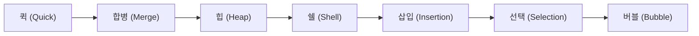

# Sort

열거된 데이터를 기준 순서 (오름차순, 내림차순 등등) 에 맞게 새로 정리하는 기법을 말한다.

## 속도 비교

```mermaid
graph LR;
  A["퀵 (Quick)"]-->B["합병 (Merge)"];
  B-->C["힙 (Heap)"];
  C-->D["쉘 (Shell)"];
  D-->E["삽입 (Insertion)"];
  E-->F["선택 (Selection)"];
  F-->G["버블 (Bubble)"];
```