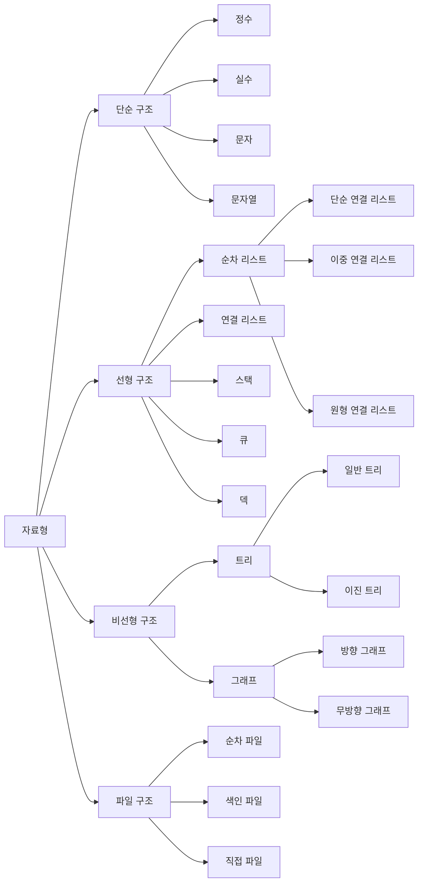

# Data Structure

자료를 효율적으로 이용할 수 있도록 컴퓨터에 저장하는 방법이다.

## List 와 Map 의 비교

### List

* 순차적으로 데이터를 저장한다.
* 값의 중복이 허용된다.
* 순차적인 접근이 필요할 경우 사용

### Map

* 키를 중복으로 저장불가 하다. (값은 가능)
* 빈 공간을 찾아서 저장하기 때문에 List 보다는 데이터 저장속도가 느릴수 있다.
* 키값을 통해서 빠르게 데이터 검색 가능