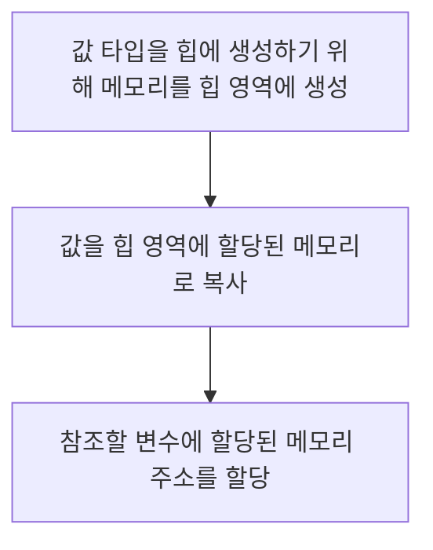
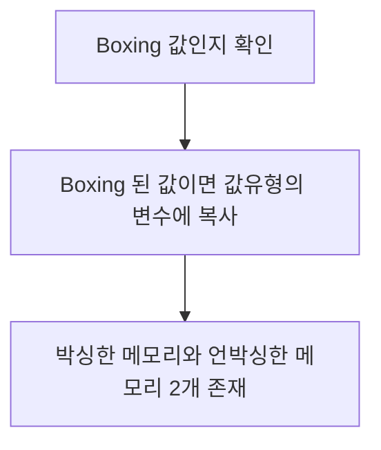
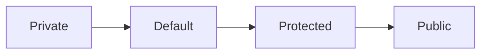

# General

## JDK & JRE 차이점

### JDK (Java Development Kit)

Java 의 응용프로그램을 개발할 수 있는 소프트웨어 개발 키트이다.

### JRE (Java Runtime Environment)

Java 프로그램 코드가 실행되는 JVM 을 지칭함

## `static` 키워드의 의미

Java Class 의 멤버 변수 또는 메소드가 속한 클래스의 인스턴스화를 요구하지 않고 액세스 할 수 있는 _**접근제어자**_ 입니다.  
`static` 접근 제어자로 지정된 변수 혹은 메서드는 Java Runtime 시에 Compile 시에 정적으로 바인딩 되기 때문에 재정의 (수정) 이 불가 합니다.

## Java 의 다중상속

Java 는 구조적으로 다중 상속이 불가능 하다. 각 클래스는 하나의 클래스에서만 상속이 가능하지만 두 개이상의 인터페이스의 구현은 가능하다.

## 인터페이스 (interface) 와 추상 클래스(abstract) 의 공통점 & 차이점

인터페이스 (interface) 와 추상 클래스 (abstract) 는 근본적으로 다른 목적에 의해 구현된다.

||interface|abstract|
|--|--|--|
|목적|함수의 구현을 강제화|상속을 통하여 기능을 이용하고 확장함|
|구현 방식|반드시 모든 메소드를 구현|모든 메소드를 구현하지 않아도 됨|
|다중 상속|가능|불가|
|접근 제어자|`public`|`private`, `protected`, `public`|
|변수|기본적으로 `final` 로써 최종 변수임|비 최종 변수를 포함할 수 있음|

## Call By Value & Reference 의 차이

Java 에서 _**Call By Value**_ 를 통한 값 전달 방식은 객체의 복사본이 전달된다는 것을 의미한다.  
즉 _**원본 데이터에 영향을 주지 않는다.**_ 객체가 참조로 전달되면 이는 실제 객체가 전달되지 않는 _**참조객체의 전달**_ 을 의미한다.

## Boxing & Unboxing (박싱 & 언방식)

Java 의 데이터는 클래스나 객체와 같은 _**참조자료형**_ 과 기본적인 _**원시타입**_ 을 가질 수 있다.  
이는 다시 말해 각각의 기초 자료형을 포장되어 있는 `Wrapper Class` 로 변환이 가능하다.


* Boxing : 값 (기초 타입) 을 참조 형식으로 변환
* Unboxing : 참조 형식을 값 형식으로 변환

|기본형 타입|참조 자료형 (Wrapper Class)|
|--|--|
|byte|Byte|
|short|Short|
|int|Integer|
|long|Long|
|float|Float|
|double|Double|
|char|Character|
|boolean|Boolean|
|void|Void|

```java
// Boxing
Object a = 20;

// UnBoxing
int b = (int) a;
```

### Boxing 과정



### Unboxing 과정



### 문제점

* 모든 객체가 값 형식으로 언박싱 될 수 없고, 이전에 박싱된 데이터에 한하여 언박싱이 가능하다.  
* 또한 박싱된 데이터의 타입을 따라야 한다.  
* 박싱 작업은 완전히 새로운 객체가 만들어져야 하며 이러한 작업은 할당 작업보다 _**최대 20배의 시간**_ 이 걸린다고 한다  
* 언박싱의 캐스팅 시간은 할당작업보다 _**4배이상**_ 의 시간이 걸린다고 한다.

### Example - JAVA

```java
public class Sum {

    // 캐스팅 시간 4배, 박싱 작업 20배 느려짐 예제
    public static void main (String[] args) {
      // long sum = 0L;
      Long sum = 0L;

      for (long i = 0; i < Integer.MAX_VALUE; i++) {
        sum += i;
      }

      System.out.println(sum);
    }
}
```

> ### 참고자료
> <http://grayt.tistory.com/87>

## Access Modifier (접근 제어자)

Java 에는 다음과 같은 접근 제어자가 있다.  
다음 순으로 접근을 허용한다.



### Private

해당 클래스 내에서만 접근 가능하다.

### Default

접근 제어자를 따로 설정하지 않은 변수 혹은 메소드는 `default` 접근 제어자가 되어 해당 패키지 내에서만 접근 가능하다.  
해당 패키지 내에서만 접근 가능하다.

### Protected

동일패키지 내의 클래스에서 접근 가능하다.
해당 클래스를 상속 받은 외부 패키지의 클래스에서 접근 가능하다.

### Public

어떤 클래스에서라도 접근 가능하다.

> ### 참고자료
> <https://wikidocs.net/232>

## 객체 재사용

대표적으로 `Singleton` 디자인 패턴과 같이 미리 사전에 생성된 `Instance` 를 재사용하는 방식으로 일반적으로 `ThreadPool` 이나 `Connection Pool` 등의 방식으로 주로 사용한다.

## 초기화 블럭 (Initialization Block)

클래스 초기화 블럭과 인스턴스 초기화 블럭이 있다.

```java
public class TEST {
  static int a;
  int b;

  static {
    System.out.println("Static initialization");
  }

  {
    System.out.println("Instance initialization");
  }

  public TEST() {
    System.out.println("Constructor");
  }

  public static void main(String[] args) {
    new TEST();
    new TEST();
  }
}
```

```java
Static initialization
Instance initialization
Constructor
Instance initialization
Constructor
```