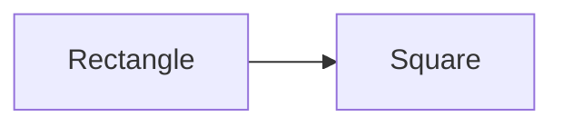

# 리스코프 치환 원칙 (LSP : Liskov Substitution Principle)

[SOLID](/book/03.-back-end/01.-java/01.-general/solid/) 원칙중에서 3번재 원칙으로 리스코프 치환 원칙 이라고 한다.

OCP (Open Close Principle : 개방 폐쇠의 법칙) 과 밀접한 연관이 있으며 OCP 를 바탕으로 구현한 템플릭 설계의 하나의 예라고 할 수 있다.  
즉 LSP 는 OCP 의 해결책 중 하나이다.

## 정의

* 자식 (파생) 클래스는 언제나 부모 (기반) 타입과 호환이 되어야 한다.
* 하위 클래스가 상위 클래스의 역할을 대신할 때 논리적으로 맞아 떨어져야 한다.

다음 예는 이를 설명하기 위한 가장 유명한 예 이다.



최초에 기반타입을 담당할 `Rectagle` 클래스를 선언한다.

여기에는 너비와 높이 등이 선언되어 있으며 도형의 넓이를 반환하는 `area` 함수까지 구현되어 있다.

```java
class Rectangle {
  private int width;
  private int height;

  public void setHeight(int height) {
    this.height = height;
  }

  public int getHeight() {
    return this.height;
  }

  public void setWidth(int width) {
    this.width = width;
  }

  public int getWidth() {
    return this.width;
  }

  public int area() {
    return this.width * this.height;
  }
}
```

`Rectangle` 클래스를 상속 받는 `Square` 클래스가 있다.
`Square` 클래스는 _**정사각형**_ 의 도형 처리를 담당하는 클래스이다.

```java
class Square extends Rectangle {
  @Override
  public void setHeight(int value) {
    this.width = value;
    this.height = value;
  }

  @Override
  public void setWidth(int value) {
    this.width = value;
    this.height = value;
  }
}
```

위의 두개의 클래스를 소비할 메인 함수이다.

```java
public class MyClass {
  static boolean checkAreaSize(Rectangle r) {
    r.setWidth(5);
    r.setHeight(4);

    if (r.area() != 20 ) {
      throw new RuntimeException("Bad Area");
    }

    return true
  }

  public static void main(String[] args) {
    checkAreaSize(new Rectangle());
    checkAreaSize(new Square()); // Error Exception
  }
}
```

이를 실행하면 두개의 클래스가 전혀 다른 결과를 가져온다.

하나는 `Rectangle` 클래스는 _**넓이가 20 으로 연산**_ 되는데 반해 `Square` 클래스는 오류를 반환한다.

이것이 바로 _**리스코프의 치환 원칙**_ 을 벗어난 대표적인 예이다.

다시 정리하면 _**상위 타입의 객체를 하위타입의 객체로 치환해도 상위 타입을 사용하는 프로그램은 정상적으로 동작**_ 해야 한다.

리스코프 치환을 벗어나는 위반사례는 대표적으로 다음과 같다.

1. 명시된 명세에서 벗어난 _**값**_ 을 반환한다.
2. 명시된 명세에서 벗어난 _**오류**_ 를 발생한다.
3. 명시된 명세에서 벗어난 _**기능**_ 을 수행한다.

## 해결 방법

* 상속관계를 제거한다.
* 문제가 되는 `area()` 를 `Square` 로 이동한다.
* LSP 를 통하여 _**자식 클래스가 상속받은 부모 클래스의 역활을 충실히 하면서 확장**_ 해나가야 한다.

> ### 참고자료
> <https://code.tutsplus.com/tutorials/solid-part-3-liskov-substitution-interface-segregation-principles--net-36710>