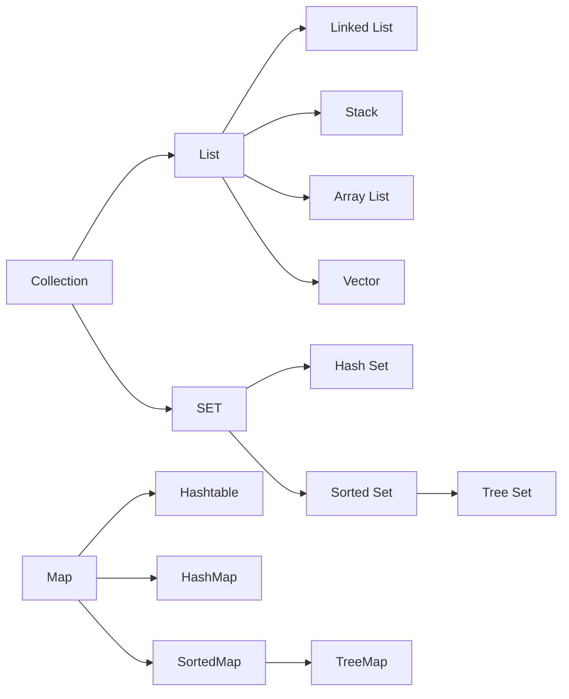

# Collection

`Collection` 인터페이스를 상속 받은 구현체 `List` 와 `Set` 을 기준으로 나뉜다.

```mermaid
  graph LR
  A["Collection"] --> B["List"]
  B --> D["Linked List"]
  B --> E["Stack"]
  B --> F["Array List"]
  B --> G["Vector"]
  A --> C["SET"]
  C --> H["Hash Set"]
  C --> I["Sorted Set"]
  I --> J["Tree Set"]
  K["Map"] --> L["Hashtable"]
  K --> M["HashMap"]
  K --> N["SortedMap"]
  N --> O["TreeMap"]
```

> ### 참고자료
> <http://withwani.tistory.com/150>