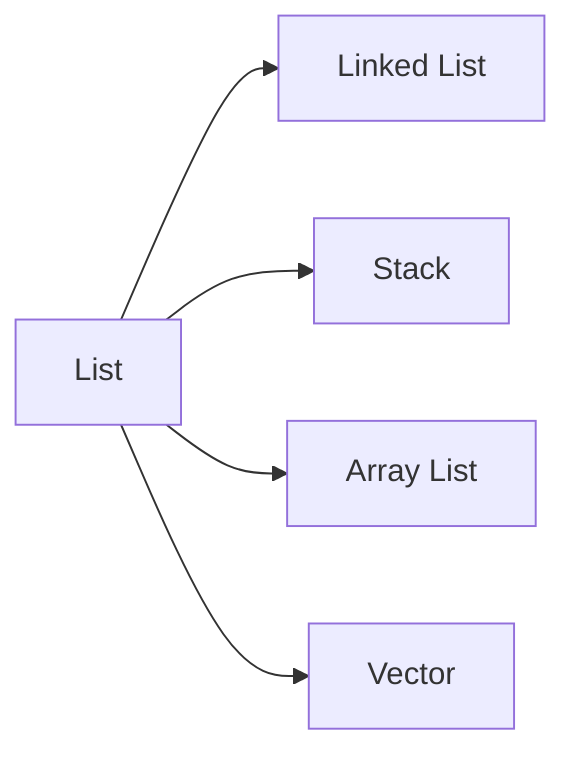

# List

순서가 있는 `Collectaion` (삽입된 순서)  
Data 를 중복해서 포함할 수 있다.

* Linked List
* Stack
  * 후입선출 (LIFO : Last-In First-Out) 구조로 되어 있다.
* ArrayList
  * 동기화를 보장하지 않는다.
  * 배열의 동적 메모리 증가 기능을 구현한 클래스
* Vector  
  * 자동으로 동기화를 보장해 준다.
  * ArrayList 의 동기화가 보장되도록 최적화한 클래스
  * JDK 5.0 이후부터 Auto Boxing / UnBoxing 기능을 지원
* Tree Set
  * 정렬 기능을 지원 (데이터들이 자동으로 오름차순으로 정렬)

> AutoBoxing
> 기본 데이터 타입을 Wrapper 클래스형의 객체로 자동 변환해주는 기능

## Array & ArrayList 의 차이점

||Array|ArrayList|
|--|--|--|
|Resize 여부|고정크기|가변크기|

## ArrayList 와 LinkedList 의 차이점

||ArrayList|LinkedList|
|--|--|--|
|데이터 구조|인덱스 기반|이전과 다음 요소를 가르키는 포인터 기반|