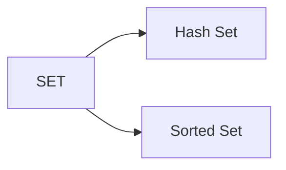

# Set

집합적인 개념의 Collection  
순서의 의미가 없다.  
Data 를 중복해서 포함할 수 없다.

```mermaid
  graph LR
  C["SET"] --> H["Hash Set"]
  C --> I["Sorted Set"]
```

* Hash Set
  * Hash 기법을 사용하지만 Set 인터페이스를 구현하고 있다.
* Sorted Set
  * 정렬 기능을 지원함