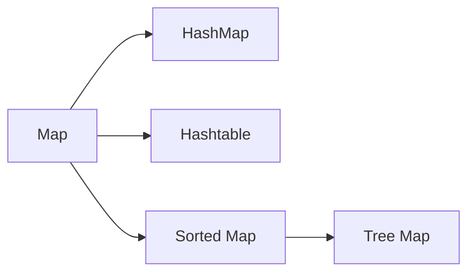

# Map

`Key` 와 `Value` 의 형태로 데이터를 관리한다.

* HashMap
  * 동기화 보장이 안된다.
* Hashtable
  * 동기화 보장이 된다. (멀티스레드 환경에서 안정적)
* TreeMap
  * 정렬 기능을 지원함

## Hashtable & ConcurrentHashMap

`HashMap` 을 thread-safe 하도록 만든 클래스가 ConcurrentHashMap 이며, key & value 에 null 을 허용하지 않는다.  
둘 다 동기화 보장을 하는 특징이 있지만 구조적으로 작은 차이가 있다.

* Hashtable
  * `synchronized` 키워드를 Method 전체에 Lock 을 적용한다.  
  * 상대적으로 안정하지만 확장성이 떨어진다.
  * Hashtable 을 참조하는 Thread 의 갯수가 많아질수록 Lock 을 획득하기 위한 시간비용이 많이 들어 성능이 급격히 낮아진다.
* ConcurrentHashMap
  * 내부적으로 여러개의 세그먼트를 두고 각 세그먼트마다 별도의 락을 가지고 있다.
  * 동시에 데이터를 삽입, 참조 하더라도 그 데이터가 다른 세그먼트에 위치하면 서로 Lock 을 얻기 위해 경쟁하지 않는다.
  * 이러한 방식을 _**Lock Striping**_ 이라고 한다.

> ### 참고자료
> <http://egloos.zum.com/Agbird/v/4849046>

## HashMap 의 동작 과정

Java 에서의 HashMap 은 Key & Value 를 쌍으로 저장한다.  
이는 Hash 함수를 필요로 hashCode 를 통하여 값을 저장하고 불러내는 과정을 거친다.