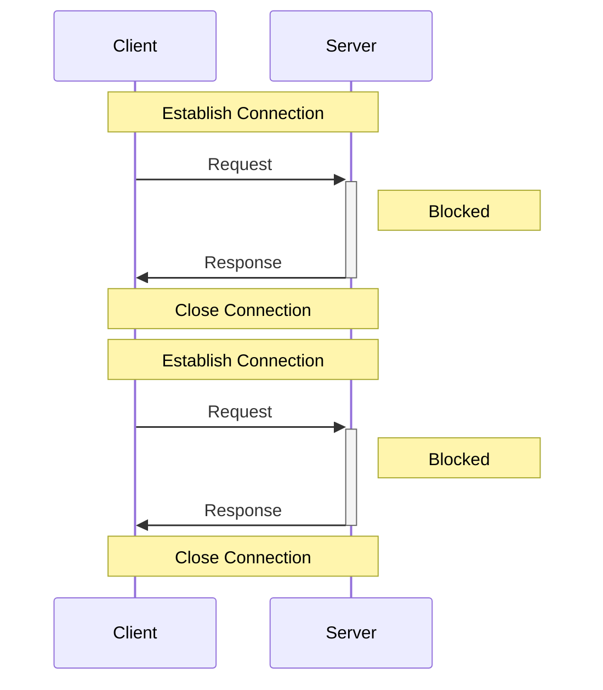
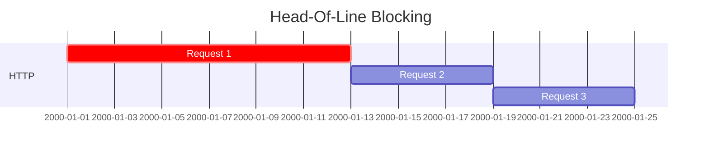
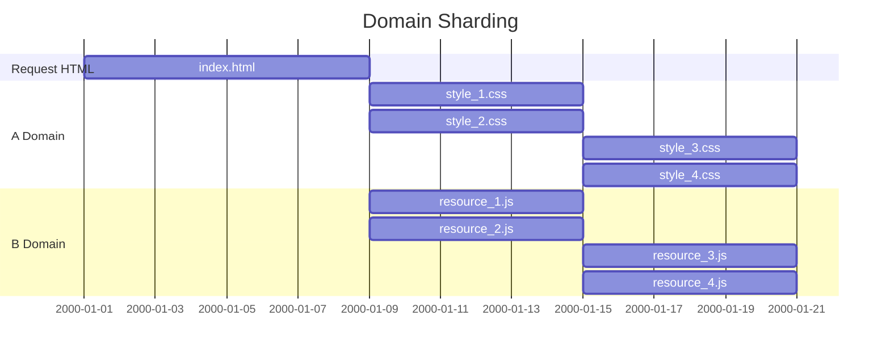
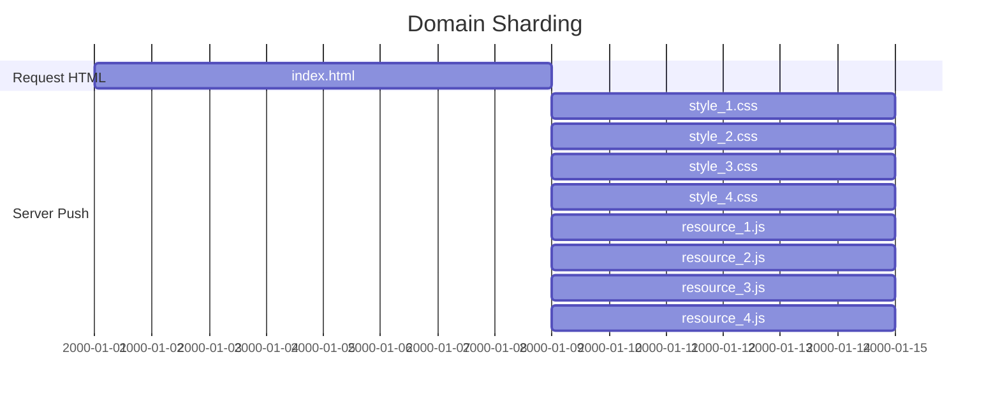

# HTTP 2.0

## HTTP1 의 요청 방식

HTTP1 에서는 앞에서 날렷던 요청의 응답을 받아야만 다음 요청이 처리될 수 있다.

이러한 현상을 해결 하기위해 지속 커넥션 (Persistent Connection) 이라는 개념과 HTTP 파이프 라이닝 (Pipelining) 이라는 개념이 들어갔다.  
커넥션을 재사용할 수 있고, `Request` 를 미리 여러개 서버로 요청할 수 있게 되었다.

하지만 근본적으로 `Request` 보낸 순서대로 `Response` 를 받을수 있다는 점에서는 문제해결이 어려워 보인다.

## HOL (Head-of-Line Blocking) 의 문제점

만약 처음에 요청한 `Request` 에 문제가 있어 `Response` 가 늦어지면 2번째, 3번째에 요청한 `Request` 의 `Response` 도 늦어지는 문제점이 발생한다.

## 도메인 샤딩

_**HOL**_ 과 같은 문제들을 해결하기 위하여 리소스를 도메인 별로 분리해서 자원을 받는 방법  
도메인별로 리소스를 병렬적으로 동시에 받을수 있다.

하지만 하나의 도메인별 브라우저에서 받을수 있는 커넥션의 제한 이나 _**DNS Lookup 과정과 TCP Handshake 과정에서 소요되는 시간**_ 때문에 오히려 부작용 발생 가능성이 있다.

> 브라우저당 도메인별 리소스 다운 제한은 보통 _**6 ~ 8 개정도**_ 이며 `iframe` 은 제외이다.

## 그 외 방법들

_**HTTP 1.1**_ 에서는 다음과 같은 방법을 통해서도 성능개선을 시도하였다.

1. HTTP 요청 최소화
    1. 큰 이미지를 틍으로 요청후 CSS 로 잘게 잘라서 사용
    2. BASE64 인코딩된 이미지를 요청해서 사용
2. 소스 압축
    1. HTML 의 gzip 압축 전송
    2. JS, CSS 의 소스 압축

## HTTP 2.0 의 다른점

### 바이너리로 인코딩된 데이터 전송

기존의 텍스트 기반의 데이터를 바이너리 포맷의 데이터로 사용하게 되어  
파싱이 더 빠르고 오류 발생 가능성이 적으며 하나의 플레인 데이터를 프레임 단위로 나눠서 관리 및 전송할 수 있다.

HTTP 2.0 은 Frame 과 Stream 이라는 개념이 적용 되었다.

> HTTP 1.x 시절에는 요청 (Request) 과 응답 (Response) 으로 명확히 구분되었다.

* Frame
  * HTTP2 통신에서 데이터를 주고 받을수 있는 가장 작은 단위의 데이터
  * 헤더 프레임, 데이터 프레임으로 구성
* Stream
  * `Server` 와 `Client` 사이의 양방향으로 데이터를 주고 받는 한개 이상의 _**메세지**_ 를 의미한다.

> 스트림 = 메세지 + 메세지 + 메세지 + 메세지 + 메세지 + 메세지 + ...  
> 메세지 = 프레임 + 프레임 + 프레임 + 프레임 + 프레임 + 프레임 + ...

### 우선순위 설정

상대적으로 중요한 리소스를 먼저 다운로드 받게 끔 전송 스트림의 우선순위 설정이 가능하다.

### Server Push

요청한 클라이언트에게 서버가 알아서 필요한 리소스를 찾아서 내려준다.

하지만 _**브라우저가 캐싱된 데이터**_ 나 _**필요없는 리소스 데이터**_ 는 자원의 낭비를 초래할 수 있다.

### 헤더의 압축

HTTP2 의 Header 는 _**Header Table 로 관리**_ 되어 _**이전 요청에서 중복으로 선언된 헤더는 인덱스 값만 전송하여 데이터를 최소화**_ 한다.

### 적용 방법

1. TSL / SSH 인증서 필요
2. 웹서버의 세팅

### 고려사항

일부 환경에 대해서는 효율이 떨어져 적용 환경에 따른 고려가 필요하다.

#### HTTP 2.0 효율이 낮은 경우

HTTP 1.1 보다 성능적으로는 우수하지만 적용하였을때의 아래와 같은 상황일 경우 성능적 이점이 차이가 없는 경우도 있다.

* HTTP 만 사용하는 경우
  * SSL 핸드셰이크 시간이 추가적으로 필요하여 추가 시간 소요
* 도메인이 많은 경우
  * 도메인별로 동작하므로 도메인별로 커넥션이 필요로 하다 이에 따른 시간적 효율이 떨어진다.
* HTTP 가 병목 현상이 없는 경우
* RTT (Round-Trip Dealy Time : 메세지를 원격에 보내고 그것이 돌아오는 응답시간 - 레이턴시) 가 작은 경우
  * 레이턴시가 큰 경우에만 더 큰 효율을 얻을수 있기 때문에 RTT 가 매우 작은 경우에는 이점이 없다.
* 페이지 내의 리소스가 적은 경우
  * 6개 이하의 리소스를 가진다면 커넥션 재사용의 가치가 떨어진다.

일부 클라이언트 브라우저에 의해서 지원 가능성이 상이하여 확인이 필요하다.

#### 지원 가능 브라우저

* IE11 (Win10 ver)
* IE Edge
* Chrome
* IOS Chrome
* Firefox
* Opera
* [기타 브라우저](https://caniuse.com/#feat=http2)

> ### 참고자료  
> <https://d2.naver.com/helloworld/140351>  
> <http://americanopeople.tistory.com/115>  
> <https://www.popit.kr/나만-모르고-있던-http2/>  
> <https://kinsta.com/learn/what-is-http2/>