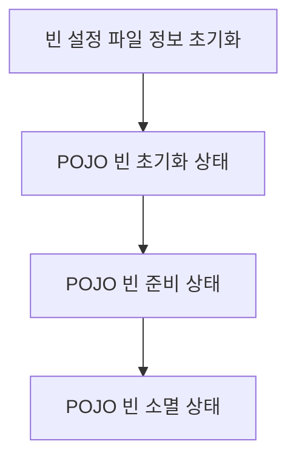

# Bean

스프링 (정확히는 스프링 컨테이너) 에서 생성 및 및 관계 설정, 사용등을 제어해주는 객체

## Bean Factory

* 스프링이 IoC 를 담당하는 핵심 컨테이너
* 빈을 등록/생성/조회/반환/관리 하는 기능으로 bean factory 와 같지만 여기에 spring 의 각종 부가서비스를 추가로 제공해야 한다.

## Application Context

* bean factory 를 확장한 IoC 컨테이너

## Container (IoC Container)

* 객체를 관리하는 컨테이너로써 컨테이너에 객체를 담아두고 필요할 때에 컨테이너에서 객체를 가져와 사용할 수 있도록 한다.
* IoC 방식으로 Bean 을 관리한다는 의미에서 Bean Factory 나 Application Context 를 가르킨다.

## POJO (Plain Old Java Object)

* ??????????

## Spring Bean Life Cycle

### POJO (Plain Old Java Object) 초기화 과정

1. Spring Framework 는 먼저 `Bean` 설정파일의 POJO 빈을 Instance 화 하지 않은 상태로 `Bean` 설정 파일의 정보를 초기화 한다.
    1. 빈 설정 파일의 정보를 초기화 하면서 XML DTD 에 대하여 유효한지 체크한다.
2. Bean Instance 를 생성하면서 의존 관계에 있는 Bean 이 존재하는지 여부를 체크한다.
    1. 의존 관계가 없는 Bean 인 경우 초기화가 실패 한다.
3. 의존 관계가 있는 빈의 체크가 완료되면 `setter Method` 를 호출하거나 생성자의 인자로 실질적인 값을 추가하거나 다른 Bean 에 대한 Reference 로 전달한다.
4. Application Context 를 이용하여 초기화를 실행한다.
    1. 생성한 Bean 이 BeanNameAware Instance 이면 setBeanName() Method 를 호출한다.
    2. 생성한 Bean 이 BeanFactoryAware Instance 이면 setBeanFactory() Method 를 호출한다.
    3. 생성한 Bean 이 ApplicationContextAware Instance 이면 setApplicationContext() Method 를 호출한다.
    4. 생성한 Bean 이 InitalizingBean 인스턴스이면 afterProperties() Method 를 호출한다.
5. 생성한 Bean 의 설정파일에 init-method 가 설정되어 있다면 init-method 에 해당하는 Method 를 호출한다.

### 종료 Method 를 호출하는 과정

1. 생성한 Bean 이 DisposableBean Instance 이면 distory() Method 를 호출한다.
2. 생성한 Bean 설정파일에 distory-method 가 설정되어 있으면 destory-method 에 해당하는 메소드를 호출한다.

#### Bean Life Cycle 을 커스터마이징 하여 제어 할 수 있다.

> ### 참고자료
> <http://javaslave.tistory.com/48>