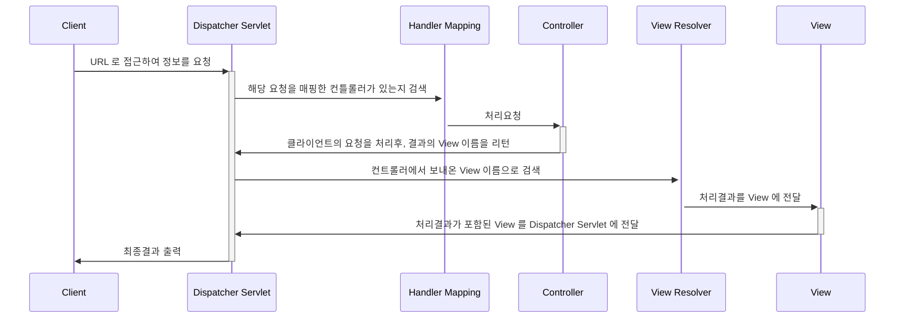

# Dispatcher Servlet

_**MVC (Model, View, Controller)**_ 구조로 구성되어 있는 `Spring Framework` 내에 원활한 처리를 위한 과정이다.

## 동작 구성

1. 클라이언트가 요청한 정보를 최초에 `DispatcherServlet` 에서 가로챈다.
   * `web.xml` 에 등록되어 있는 `DispatcherServlet` 의 `<url-pattern>` 이 `'/'` 로 등록 되어 모든 URL 패턴에 동작 되기 때문이다.
   * 특정 URL 에만 적용이 필요하면 `<url-pattern>` 내용의 범위만 바꿔주면 된다.
2. 가로챈 정보를 `HandlerMapping` 에게 보내 해당 요청을 처리할 수 있는 `Controller` 를 찾아낸다.
3. 요청을 처리할 `Controller` 를 찾아 냈으면 해당 `Controller` 에게 해당 요청 정보를 보내준다.
4. `Controller` 는 해당 요청 내용을 처리 후 요청을 응답 받을 `View` 의 이름을 리턴하게 된다.
   * 실제로 응답전에 `View Resolver` 가 미리 응답할 내용을 분석하여 해당 `View` 이름을 검색 한다.
5. 해당 `View` 가 있다면 처리 결과를 `View` 에 보낸후 이 결과를 다시 `DispatcherServlet` 에 보낸다.
6. `DispatcherServlet` 은 받은 정보를 최종적으로 클라이언트에 전송하게 된다.

> ### 참고자료
> <http://egloos.zum.com/springmvc/v/504151>