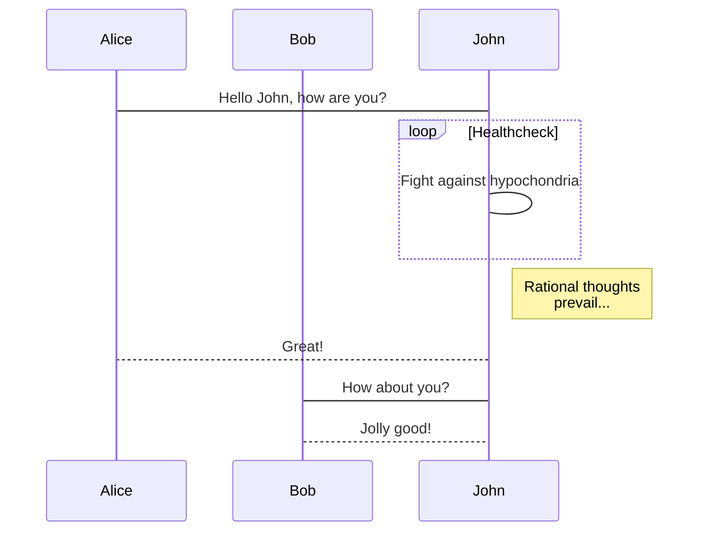
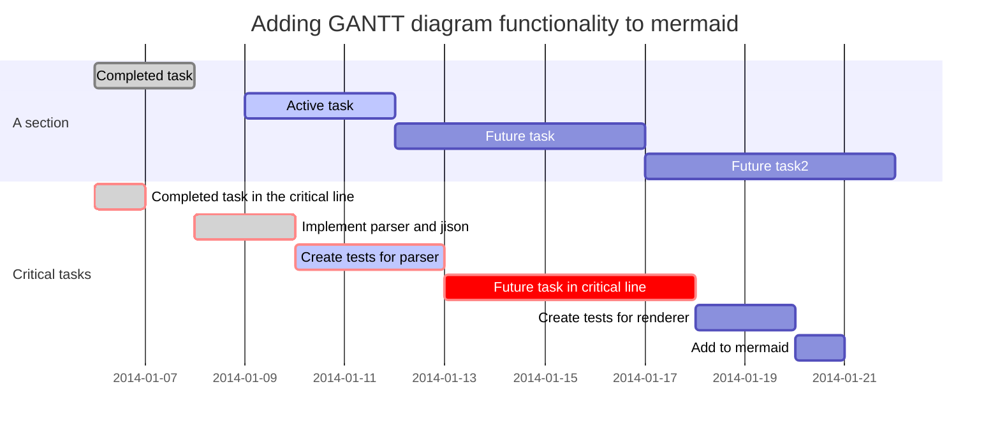
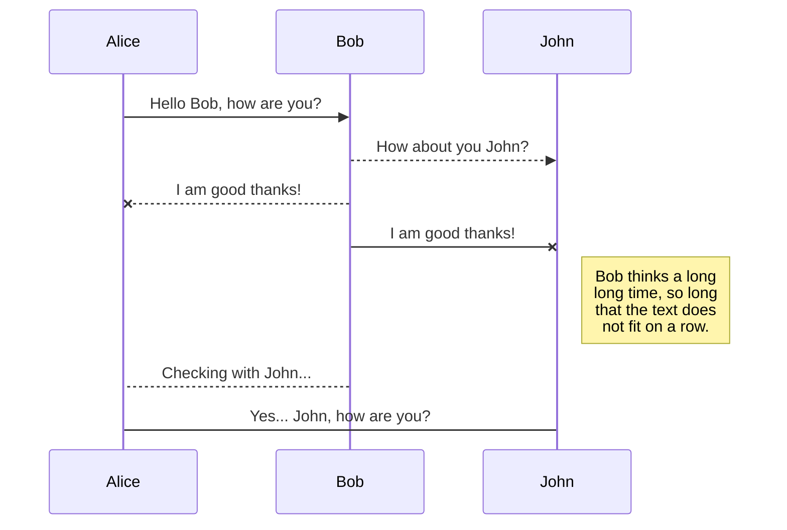
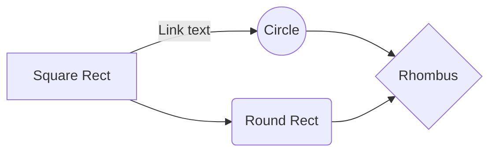
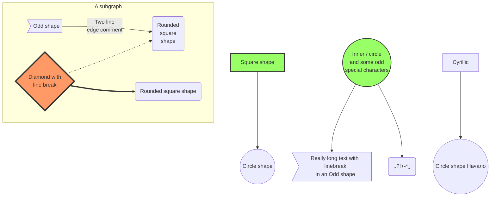
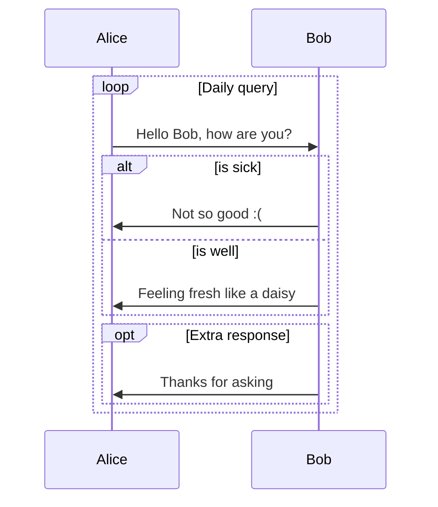

# Manual

이 Gitbook 의 사용법과 Syntax 를 정의한다.

## CLI (Command Line Interface)

```bash
# Build (빌드에 필요한 라이브러리, 플러그인 등을 설치)
$ gitbook install

# Local Server (로컬 환경에서 확인)
$ gitbook serve

# Remote Static Publish (`gh-pages` 브랜치에 푸시하기 위한 빌드 스크립트)
./publish_gitbook.sh
```

## Tip

### 맥 백쿼트(`) 만들기

```bash
$ if ! [ -f ~/Library/KeyBindings/DefaultkeyBinding.dict ]; then mkdir -p ~/Library/KeyBindings && echo '{"₩" = ("insertText:", "\`");}' > ~/Library/KeyBindings/DefaultkeyBinding.dict; fi
```

> 바로 적용이 안된다면 **재부팅** 한다.

### VSCode 마크다운 설정 수정

```markdown
"markdownlint.config": {
        "MD001": false,     // 순차적 헤더
        "MD024": false,     // 중복 헤더 제목
        "MD026": false      // 헤더에 특수문자
    }
```

## 다이어그램 (mermaid)















> ### 참고자료
> <https://mermaidjs.github.io/>